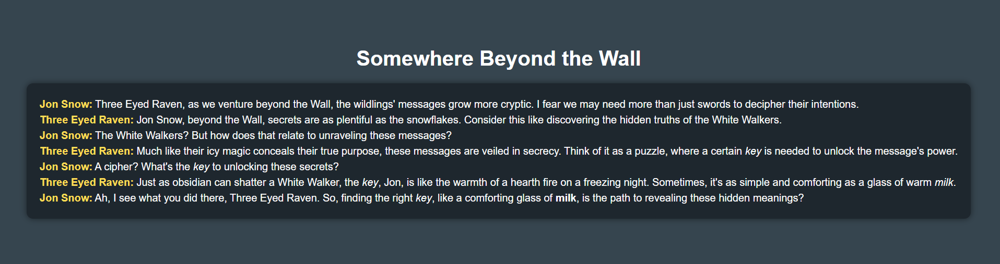
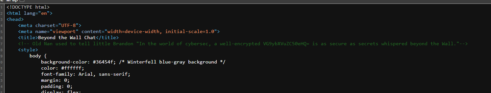
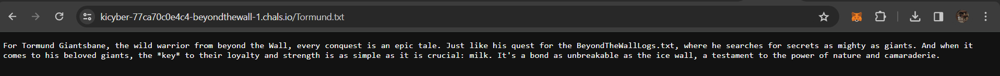
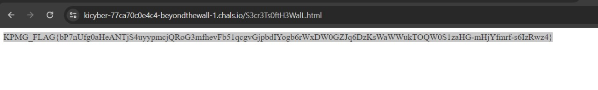

I spawned the machine and got this link `https://kicyber-77ca70c0e4c4-beyondthewall-1.chals.io/`

I got this conversation in the page.

<figure></figure>

Once I inspected the source code I got this.

<figure></figure>

This code `VG9ybXVuZC50eHQ=` was in base64, decoded to which it came upto `Tormund.txt`.

On going to that endpoint I found another file `BeyondTheWallLogs.txt`

<figure></figure>

I found This cipher 

```
Uv erq zpkxu zp ozjzfwrbmxsi, ippbq essexpbe wq cqkcofa pmtw erdwfqt bso owcbulzbe wq malp, ddcp zaepb xqpc uv erq almdmo /C3oz3Ec0rbS3GmtW.rfuw. Tgae ke lckswyc sclbp bsouz symzoop bcomafbqa, pxozjzfqzx eiqosclbpa erq ujcfmcsqa zp piek, qvdedqyq avwi fpp gazerk uli gvwyos tde myssulduk pwnzlmq.
```

On a little bit of research I found out this was `Vigenere Cipher`.

Once I decoded it, it led me to another page at the endpoint `/S3cr3Ts0ftH3WalL.html`.

And I found the flag there.

<figure></figure>

```
KPMG_FLAG{bP7nUfg0aHeANTjS4uyypmcjQRoG3mfhevFb51qcgvGjpbdIYogb6rWxDW0GZJq6DzKsWaWWukTOQW0S1zaHG-mHjYfmrf-s6IzRwz4}
```