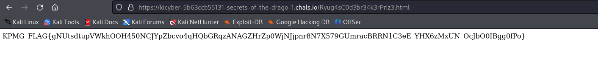

On opening the link. A webpage was present with some information about beyblades.

There were 2 images on the page which I downloaded, On inspecting them. I found something interesting.

```
strings ldrago.png
```

<figure></figure>

Upon inspecting the second image, I found `UHJpejMuaHRtbAo=` in the image description.

<figure></figure>

On translating `b64 -> text`, I got `Priz3.html`

And there we have the flag.

<figure></figure>

```
KPMG_FLAG{gNUtsdtupVWkhOOH450NCJYpZbcvo4qHQbGRqzANAGZHrZp0WjNJjpnr8N7X579GUmracBRRN1C3eE_YHX6zMxUN_OcJbO0IBgg0fPo} 
```