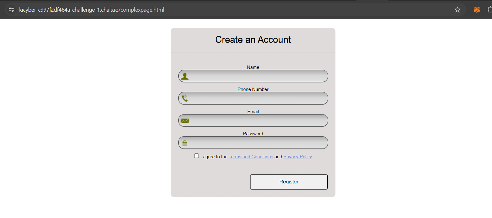

This was the first challenge of the Web App Pentest domain.

## Solution

Firstly I spawned the machine and I got this link `http://kicyber-c997f2df464a-challenge-1.chals.io/`.

Opening the link, this was the page -_-

<figure></figure>

I thought okay, lets enumerate some more.

I went to `robots.txt`.

<figure></figure>

Okay bruh -_-. I was almost pissed of but then, when I scrolled down I saw an endpoint. `/complexpage.html`

OOF. Finally, when I went to that page there was a nice login page.

<figure></figure>

On enumerating the web request I saw that the page was working on XML and that XXE injection was possbile.

<figure></figure>

And so I did a simple injection to find the flag.

<figure></figure>